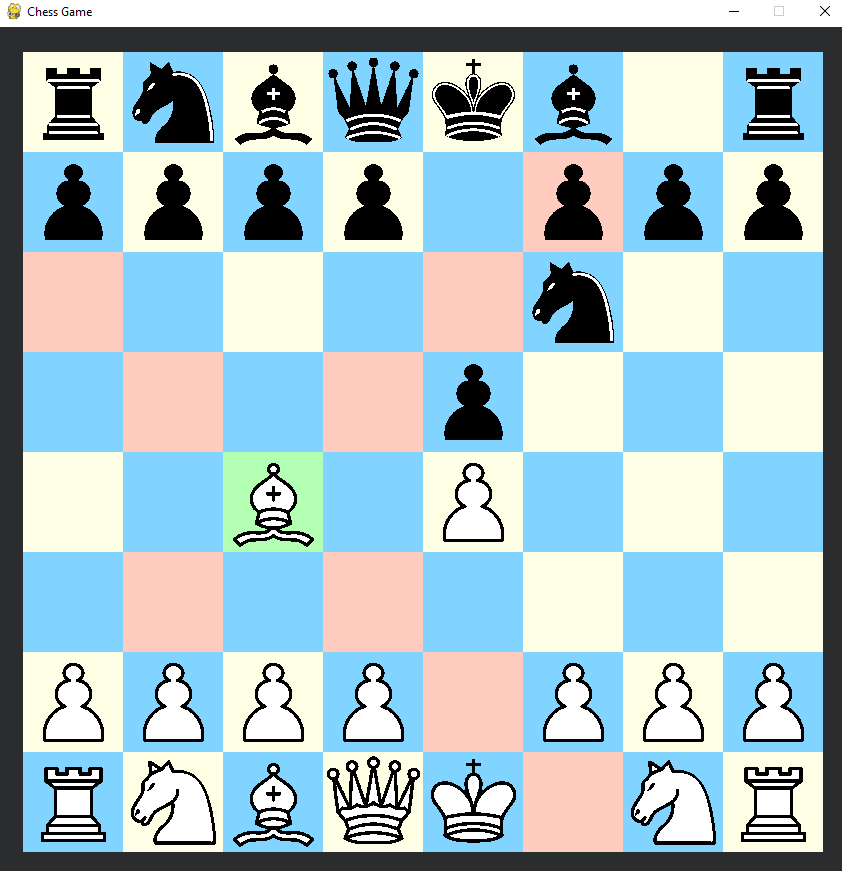

# Python Chess 

This project is a python implementation of player-Vs-player chess game. 
The game’s chess board and pieces was built using class based structures.
The implementation was created by Kamil Zych.
## References:

- Program uses pygame: 
    http://www.pygame.org/

- Chess tile graphics were used from:
    
    http://commons.wikimedia.org/wiki/File:Chess_tile_pd.png

## Required:

- Python 3.x
- Pygame
## Setup Instructions:

### For Windows:

To install pygame, use this command:
```Python
pip install --user pygame
```
To run the program, you can use the command:
```Python
python main.py
```
## Known Bugs:

- No checkmate Rule, if you lose or win you will need to close the game
- No Pawn Promotion Rule
- No Enpesant Pawn Rule
## Screenshots:



